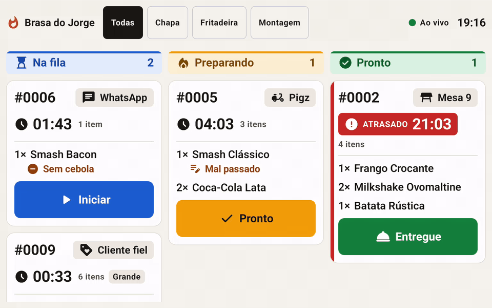
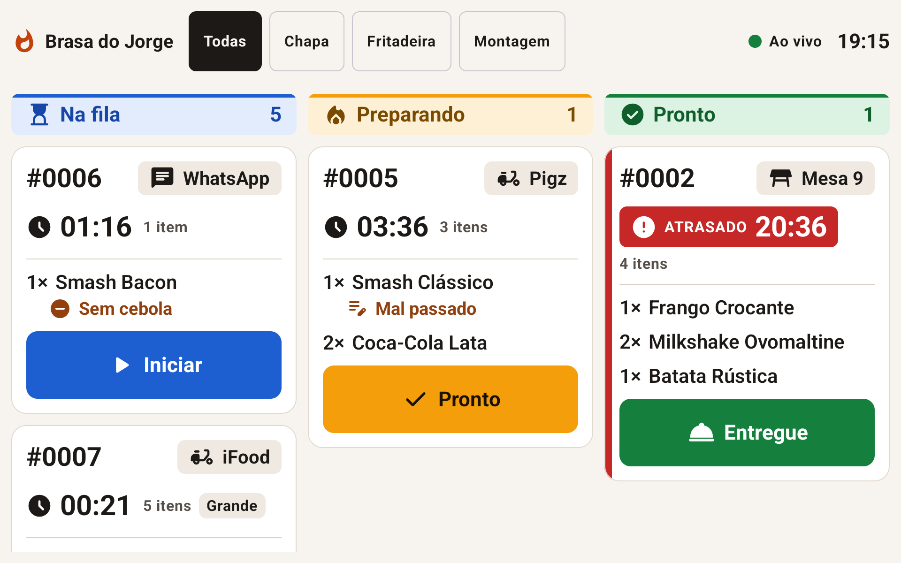
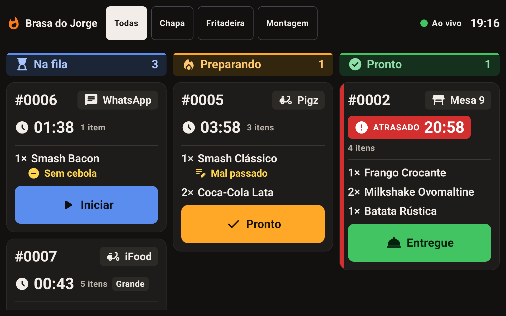
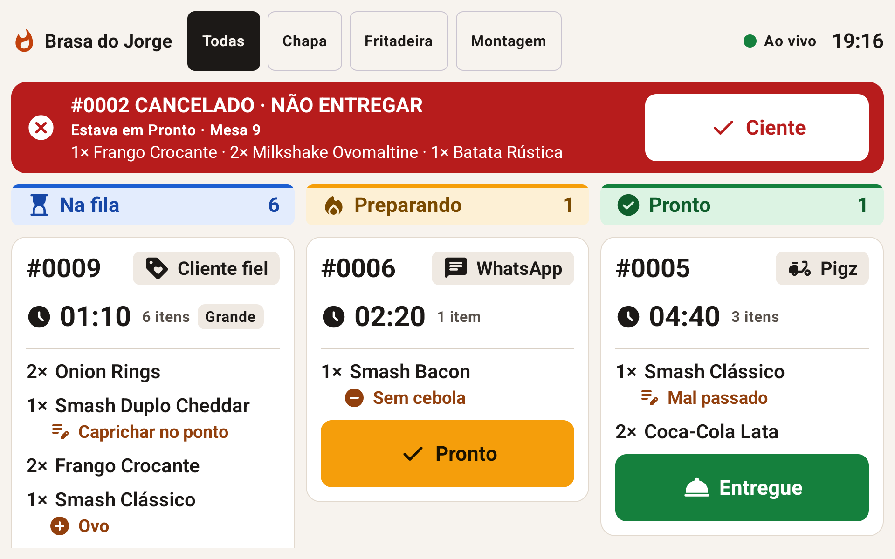
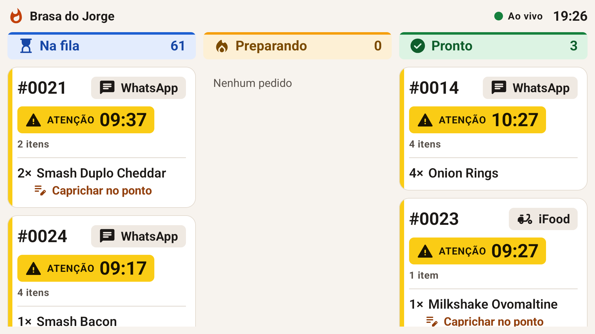
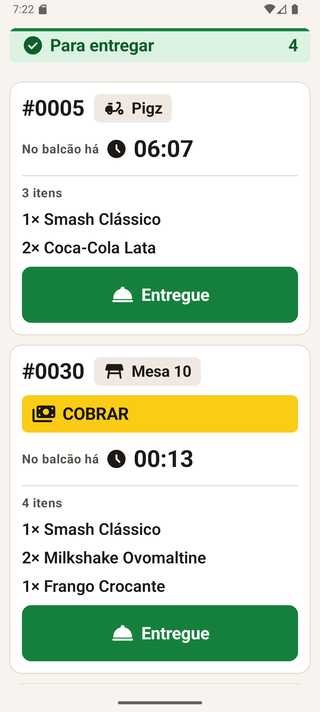

# KDS Brasa do Jorge

Kitchen Display System para a hamburgueria Brasa do Jorge, feito para o [desafio técnico da Pigz](https://github.com/orangebr/desafio-frontend-hamburgueria). Os pedidos chegam em tempo real do mock do desafio e substituem a impressora de comandas: a cozinha vê a fila no tablet, o garçom recebe os pedidos prontos no celular e uma TV na parede mostra a fila para todos.

Android nativo em Kotlin com Jetpack Compose. Um único APK assume o papel do aparelho:

| Aparelho | Tela | Para quem |
|---|---|---|
| Tablet na bancada | Board com as colunas Na fila, Preparando e Pronto | Cozinha |
| Celular | Expedição: pedidos prontos e ENTREGUE | Garçom |
| TV (Android TV ou Google TV) | Painel somente leitura | Todos, de longe |

## Telas



<table>
  <tr>
    <td></td>
    <td></td>
  </tr>
  <tr>
    <td align="center">Board no tablet, tema claro (padrão do Android)</td>
    <td align="center">O mesmo board no tema escuro</td>
  </tr>
  <tr>
    <td></td>
    <td></td>
  </tr>
  <tr>
    <td align="center">Alerta de pedido pronto cancelado</td>
    <td align="center">Painel na TV, somente leitura</td>
  </tr>
  <tr>
    <td colspan="2" align="center"></td>
  </tr>
  <tr>
    <td colspan="2" align="center">Expedição no celular do garçom</td>
  </tr>
</table>

## O que o app faz

- **Tempo real por SSE**, com reconexão automática e aviso "Reconectando"; na queda, a tela mantém o último estado.
- **Fila por ordem de chegada** com tempo de espera e faixas de atraso (atenção a partir de 8 min, atrasado a partir de 15 min) em cor, ícone e texto, e faixa lateral nos cards atrasados.
- **Um toque para avançar**, sem confirmação, com DESFAZER por 5 segundos, inclusive no ENTREGUE.
- **Modificadores em destaque** ("sem cebola", "mal passado"), itens iguais somados numa linha e selo GRANDE para pedidos de 5 itens ou mais.
- **Origem forte:** MESA 4, BALCÃO, iFOOD, WHATSAPP, PIGZ e os demais canais.
- **Cancelamento de pedido em andamento** vira alerta com alarme até alguém tocar em CIENTE, inclusive o que acontecer durante uma queda de rede.
- **Filtro por estação** (Chapa, Fritadeira, Montagem).
- **Expedição no celular:** bip e vibração quando um pedido fica pronto, COBRAR para pedido não pago e tempo no balcão.
- **Tema claro e escuro**, seguindo o modo do Android, que por padrão é claro, em todos os aparelhos.

## Como rodar

### Pré-requisitos

- **Node.js 18 ou mais novo**, para o mock.
- **Android Studio** com o Android SDK 37 (ou só o SDK, com `ANDROID_HOME` apontando para ele).
- **JDK 17** para rodar o Gradle. O Gradle baixa sozinho o JDK 21 que os testes usam.
- **Um emulador ou aparelho** com Android 8.0 ou mais novo. Para ver as três telas: um tablet (perfil "Small Tablet", 1920x1200), um celular ("Medium Phone") e uma TV ("Television 1080p").

### 1. Subir o mock

Na raiz do repositório:

```bash
node mock/server.js
```

O mock sobe em `http://localhost:4000` e cria um pedido novo a cada 5 segundos.

### 2. Instalar o app

Abra outro terminal na raiz do repositório (o mock continua rodando no primeiro) e deixe o emulador aberto.

Se o projeto nunca foi aberto no Android Studio, diga ao Gradle onde está o Android SDK; ao abrir o projeto, o Android Studio faz isso sozinho. Com o SDK no local padrão:

```bash
export ANDROID_HOME="$HOME/Library/Android/sdk"
```

No Linux, o local padrão é `$HOME/Android/Sdk`. No PowerShell do Windows:

```powershell
$env:ANDROID_HOME="$env:LOCALAPPDATA\Android\Sdk"
```

No mesmo terminal:

```bash
./gradlew :app:installDebug
```

No Windows, use `.\gradlew.bat :app:installDebug`. Depois, abra "KDS Brasa do Jorge" no aparelho: o tablet mostra o board, o celular mostra a Expedição e a TV mostra o painel.

O emulador enxerga o computador em `10.0.2.2`, que é o endereço padrão do app. Num **aparelho físico** na mesma rede Wi-Fi, informe o IP do computador:

```bash
./gradlew :app:installDebug -Pkds.serverUrl=http://192.168.0.10:4000/
```

Ou deixe o endereço fixo em `local.properties`, que não vai para o Git:

```properties
kds.serverUrl=http://192.168.0.10:4000/
```

### 3. Rodar os testes e as verificações

Os mesmos passos do CI:

```bash
./gradlew test
```

```bash
./gradlew ktlintCheck :build-logic:convention:ktlintCheck :app:lintDebug
```

São 263 testes, inclusive os de interface, que rodam na JVM com Robolectric, sem emulador.

### Simular a cozinha

O mock só cria pedidos; quem avança as etapas é a cozinha. Para ver a Expedição e os alertas sem tocar no tablet, mude um pedido direto no mock (troque o `12` pelo número de um pedido da fila):

```bash
curl -X PATCH http://localhost:4000/orders/12 -H "Content-Type: application/json" -d '{"stage":"PREPARING"}'
```

```bash
curl -X PATCH http://localhost:4000/orders/12 -H "Content-Type: application/json" -d '{"stage":"READY"}'
```

O primeiro põe o pedido em preparo; o segundo o deixa pronto, e o celular bipa e vibra. Com `{"stage":"CANCELED"}` num pedido em preparo ou pronto, o alerta de cancelamento aparece.

No PowerShell do Windows, `curl` é outro comando; use:

```powershell
Invoke-RestMethod -Method Patch -Uri http://localhost:4000/orders/12 -ContentType 'application/json' -Body '{"stage":"READY"}'
```

Para simular o pico, com um pedido novo a cada 0,3 segundo:

```bash
EVENT_INTERVAL_MS=300 node mock/server.js
```

No PowerShell: `$env:EVENT_INTERVAL_MS=300; node mock/server.js`.

### Tema claro

O app segue o modo do Android: em Configurações, Tela, desligue o tema escuro. No emulador, também dá para trocar pelo terminal, e a tela muda sem reabrir o app:

```bash
adb shell cmd uimode night no
```

### Instalar numa TV

É preciso uma TV com Android TV ou Google TV, ou uma TV comum com um aparelho desses no HDMI (Chromecast com Google TV, Mi Box). O APK é o mesmo. Com a depuração ativada na TV:

```bash
adb connect 192.168.0.20
```

```bash
./gradlew :app:installDebug
```

Sem computador, dá para instalar pela própria TV com o app "Downloader", a partir de um link direto para o APK.

## Decisões e trade-offs

O detalhe de cada decisão, com as alternativas e o custo, está em [docs/ARCHITECTURE.md](docs/ARCHITECTURE.md). Em resumo:

- **Kotlin e Compose.** É a preferência da Pigz para um app nativo de tablet de cozinha e a stack que domino. Tipagem forte, `when` exaustivo na máquina de estados e testes rápidos na JVM.
- **SSE para o tempo real.** O mock já oferece, o fluxo é do servidor para o cliente, e as poucas ações da cozinha cabem em REST. Polling teria latência e carga constante; WebSocket, um canal nos dois sentidos que ninguém usa.
- **O que costuma ser esquecido no tempo real:** o OkHttp não reconecta sozinho (reconexão com backoff de 1 a 30 s e jitter), a conexão pode ficar muda (heartbeat de 15 s no mock e timeout de leitura de 45 s no app) e a cozinha pode ter rede local sem internet.
- **Evento duplicado não duplica pedido.** O mock ganhou um número de versão por pedido, e o reducer só aplica versão maior: evento repetido, fora de ordem ou eco do próprio toque não muda nada.
- **Ciclo de vida numa máquina de estados**, a mesma tabela no app e no mock, que agora recusa transição inválida com 409 e o pedido atual.
- **Desfazer por envio adiado.** O toque muda o card na hora e o envio sai depois de 5 segundos; desfazer cancela o envio. Custo aceito: se o app morrer nesses 5 segundos, o toque se perde e o card fica na etapa anterior.
- **Hilt em vez de Koin**, pela validação do grafo na compilação: o app roda sozinho no tablet durante o pico.
- **Domínio em Kotlin puro**, num módulo sem Android: o compilador garante que nenhuma regra dependa da tela.
- **Aguentar o pico:** lista com chave estável, mapeamento fora da thread principal e um relógio único que recompõe só o timer. Medido no emulador com centenas de pedidos e um novo a cada 0,3 s, a carga aumenta os quadros lentos mas não cria travadas longas (números em [ARCHITECTURE.md](docs/ARCHITECTURE.md#aguentar-o-pico)).

## O que priorizei e o que cortei

Priorizei o núcleo que resolve as dores mais caras do Seu Jorge: tempo real confiável, a fila que não duplica nem some pedido, o alerta de cancelamento e o board legível de longe. Depois vieram a Expedição no celular (o lanche esfriando no balcão) e, por fim, o painel de TV, que o desafio marca como opcional.

Ficaram de fora, por decisão:

- **Sincronizar chapa e fritadeira** e **pronto por item**: o back só tem etapa por pedido e não tem tempo de preparo por item.
- **Priorização automática entre delivery e salão**: é decisão do dono, não do sistema; o KDS mostra a origem forte para ele decidir.
- **Build release com R8 e medição num tablet físico**: ligar o R8 exige regras para Hilt, serialization e Retrofit, e um erro nelas quebra o app só no release, risco desnecessário perto da entrega.

## O que faria numa v2

- Guardar os alertas de cancelamento e os envios agendados no aparelho, para sobreviverem a um reinício do app.
- Fila offline de ações, reenviada quando a rede voltar.
- Corrigir os timers pela diferença entre o relógio do servidor e o do aparelho: hoje, um aparelho com a hora errada mostra tempos errados.
- Build release com R8 e medição de fluidez num tablet real.
- Métricas de tempo médio por etapa, para o dono ver o gargalo.
- Pronto por item e sincronização de estações, quando o back tiver esses dados.

## Premissas

As premissas estão em [docs/SPECS.md](docs/SPECS.md#premissas), junto com os requisitos e onde cada um foi atendido. As principais:

- Os horários do mock vêm em UTC sem o "Z"; o fuso de origem é configurável.
- O primeiro toque leva um pedido da fila direto para o preparo, porque no mock ninguém confirma pedidos.
- O tempo de espera conta desde a criação do pedido; na Expedição, o tempo no balcão conta desde a última alteração do pedido pronto.
- Um tablet na montagem com a visão geral, e "pronto" marcado no pedido inteiro.

## Como usei IA

Usei o Claude Code do começo ao fim, em passos pequenos: a IA explicava o passo, eu revisava, e nenhum commit saiu sem eu ler a mensagem. Todo commit leva o rodapé de coautoria da IA. O registro completo, com data, está em [docs/AI_USAGE.md](docs/AI_USAGE.md).

- **Onde ajudou:** ler o mock e achar as armadilhas antes de escrever o app, apresentar alternativas com custo para cada decisão, escrever código e testes, e investigar no emulador (som, vibração, fluidez).
- **Onde errou e foi corrigida:** testes que não testavam o que diziam, pegos por teste de mutação; bugs que só apareceram no emulador com todos os testes verdes (um pedido escondido acima do topo da lista, o ENTREGUE sem desfazer); comandos errados que ela me passou; e uma conclusão apressada sobre a fluidez, corrigida quando sugeri medir o build release.
- **O que eu decidi:** Hilt, a estrutura modular, o desfazer por envio adiado, as regras de negócio confirmadas, nada de números nem textos fixos no código, o tema claro e o polimento visual, e a forma de trabalhar.

## Documentação

- [docs/SPECS.md](docs/SPECS.md): dores, requisitos, onde cada um foi atendido, premissas e o que ficou fora.
- [docs/ARCHITECTURE.md](docs/ARCHITECTURE.md): módulos, caminho do pedido, decisões e trade-offs, testes e limitações.
- [docs/AI_USAGE.md](docs/AI_USAGE.md): como a IA foi usada, onde errou e o que foi decidido.
- [mock/README.md](mock/README.md): o mock, com as extensões feitas nele.
